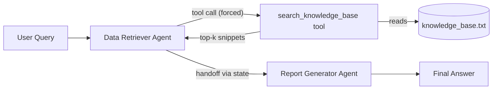

# Agentic RAG System (LangGraph + OpenAI)

A two-agent, sequential RAG pipeline: a **Data Retriever** agent that is
structurally forced to search a local knowledge base through a custom tool,
and a **Report Generator** agent that synthesizes a grounded answer from the
retrieved snippets only. Orchestration is a LangGraph `StateGraph`; the
agents communicate by handing shared state along a directed edge. Every run
prints the full evidence chain — query → retrieved snippets → final answer.

## Architecture



**Orchestration pattern — sequential handoff through shared state.** The
whole data flow is a three-field TypedDict:

```python
class PipelineState(TypedDict):
    query: str            # user question (input)
    snippets: list[str]   # Data Retriever output -> handoff to the Generator
    report: str           # Report Generator output (final answer)
```

The graph is `START -> data_retriever -> report_generator -> END`. The
retriever node writes `snippets` into the state; LangGraph then follows the
`data_retriever -> report_generator` edge and hands that state to the
generator — that edge *is* the handoff.

## Project Structure

```
├── main.py                   # entry point: staged 3-part output per query
├── knowledge_base.txt        # fictional employee handbook (21 sections)
├── requirements.txt          # pinned dependencies
├── .env.example              # template for the required OPENAI_API_KEY
├── screenshots/              # evaluation screenshots
└── src/
    ├── config.py             # all tunables, each overridable via env var
    ├── graph.py              # PipelineState + StateGraph wiring
    ├── tools/
    │   └── retrieval.py      # Chunk/load_chunks, Retriever protocol,
    │                         #   BM25Retriever, search_knowledge_base tool
    └── agents/
        ├── __init__.py       # shared ChatOpenAI factory
        ├── retriever.py      # Data Retriever: prompt + node (forced tool call)
        └── reporter.py       # Report Generator: prompt + node (grounded synthesis)
```

## Setup & Run

Requires **Python 3.11+** and an OpenAI API key.

```bash
git clone <this-repo>
cd <repo-dir>
python3.11 -m venv venv
source venv/bin/activate          # Windows: venv\Scripts\activate
pip install -r requirements.txt
cp .env.example .env              # then put your real OPENAI_API_KEY in .env
```

Run a single query (screenshot mode) or an interactive loop:

```bash
python main.py "What is the policy on international travel?"
python main.py                    # interactive; empty line or 'exit' to quit
```

Test retrieval standalone, with no LLM and no API key involved:

```bash
python -m src.tools.retrieval
```

## Example Output

```
============================================================
[1] USER QUERY
    What is the policy on international travel?
------------------------------------------------------------
[2] RETRIEVED SNIPPETS  (Data Retriever Agent -> tool call)
    (1) [International Travel Insurance] All international business trips are automatically covered...
    (2) [International Travel Approval Process] Employees traveling internationally for business...
    (3) [International Travel Daily Allowance] For approved international business trips...
------------------------------------------------------------
[3] FINAL ANSWER  (Report Generator Agent)
    Summary of the company policy on international travel

    Approval & booking
    - Obtain written approval from your department head at least 14 days
      before departure by submitting an "Overseas Trip Request" in TravelHub...
    - Trips longer than 10 business days also require sign-off from the
      Managing Director.

    Allowances, hotels & expenses
    - Daily allowance: 2,400 THB per full calendar day abroad; departure and
      return days paid at half rate (1,200 THB)...

    Insurance & claims
    - All international business trips are automatically covered by
      SafeJourney Plan B... emergency medical treatment up to 3,000,000 THB...
============================================================
```

More runs (multi-section synthesis, the not-found case, short ambiguous
queries) are captured in [screenshots/](screenshots/).

## Design Decisions

**Why LangGraph.** The assignment's core is orchestration. LangGraph makes
the orchestration *inspectable*: agents are nodes, the execution order is an
explicit edge list, and the data contract between agents is a typed state
schema. `src/graph.py` shows the entire system topology in ~10 lines.

**Why sequential handoff via shared state.** The task specifies a sequential
workflow in which the retriever's output feeds the generator. Shared state
makes that handoff a first-class, visible object (`snippets`) instead of an
implicit function-call chain, and it extends naturally (add a node, add an
edge) without touching existing agents.

**BM25 first, semantic as an upgrade path.** Keyword BM25 (`rank-bm25`) is a
dependable baseline: no model downloads, explainable scores, trivial to debug.
Its known weakness is paraphrase: "work from home" misses the section worded
"work remotely" — in testing, that section scored 1.33 while incidental
single-word noise reached 1.67, so no threshold can separate them. That is a
vocabulary-mismatch problem, which is exactly what embeddings solve; the
`Retriever` protocol + `get_retriever()` factory (selected by `SEARCH_MODE`)
is the seam where a semantic implementation drops in without touching the
tool signature, the agents, or the graph.

**Relevance threshold (`MIN_SCORE = 2.0`), tuned empirically.** Measured on
the test matrix: incidental single-term matches (e.g. "salary" appearing in
unrelated sections for the query "What is the CEO's salary?") score ≤ ~1.7,
while genuinely relevant matches score ≥ ~2.1. The threshold 2.0 splits the
bands with margin on both sides, so off-KB queries return an *empty* result
instead of a least-bad match.

**Guardrails, in three layers.**
1. *Structural* — the retriever binds the tool with `tool_choice="required"`,
   so it mechanically cannot answer from its own knowledge. Enforcement in
   code beats requests in prose.
2. *Prompt* — the generator must use only the provided snippets, merge
   overlapping facts, and fall back to one fixed sentence when the snippets
   are insufficient.
3. *Deterministic* — when retrieval returns zero snippets, the generator node
   short-circuits and returns the fixed not-found sentence without an LLM
   call, guaranteeing the fallback byte-for-byte.

**Grounding proven by fictional facts.** The knowledge base is packed with
invented specifics no model could know from pretraining — TravelHub,
SafeJourney Plan B, VitalCare Gold, a 119-day probation, a 2,400 THB daily
allowance, a 6 THB/km mileage rate. When an answer contains these, retrieval
is the only possible source, making grounding verifiable rather than assumed.

## Knowledge Base Design

21 handbook sections for the fictional **Siam Innovate Co., Ltd.** (~100
words each, split on `--- Section Title ---`), with three properties built
in deliberately:

1. **Cross-chunk synthesis** — international travel is split across three
   sections (Approval Process / Daily Allowance / Insurance), so a good
   travel answer must merge multiple chunks.
2. **Overlap for de-duplication** — *Remote Work Policy* and *Hybrid Work
   Guidelines* both state the 3-day-per-week limit and the FlexWork/Thursday
   rule; a correct summary states each fact once.
3. **A designed gap** — no section mentions executive salaries, so
   "What is the CEO's salary?" must end in the not-found fallback instead of
   a hallucination.

## Limitations & Next Steps

- **Paraphrase-blind keyword search** — the documented BM25 gap; next step is
  the semantic `SEARCH_MODE` (local `sentence-transformers` embeddings behind
  the existing `Retriever` protocol).
- **No re-ranking or citations** — snippets go to the generator in BM25
  order; a cross-encoder re-ranker and per-claim citation markers would
  harden answer quality at larger KB sizes.
- **Single-turn only** — no conversation memory; LangGraph's checkpointer
  would add it without changing the pipeline shape.
- **In-memory index** — ideal at 21 chunks (index build: <1 ms, warm query:
  ~0.01 ms). At ~100k chunks this becomes batch offline embedding, an
  external vector store, and an approximate-nearest-neighbour index.
- **No automated eval harness** — behaviour is verified against a 5-query
  matrix by hand; a scripted regression suite (expected-section assertions
  per query) would catch retrieval drift on KB edits.
